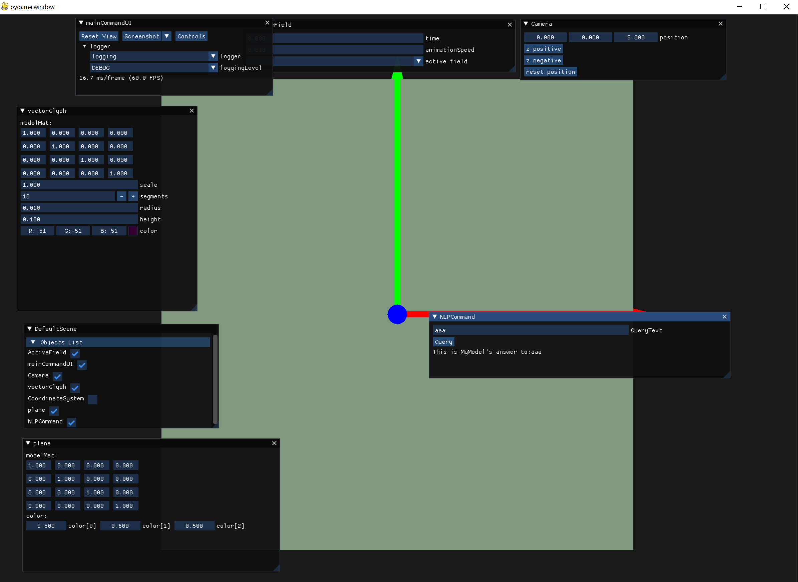
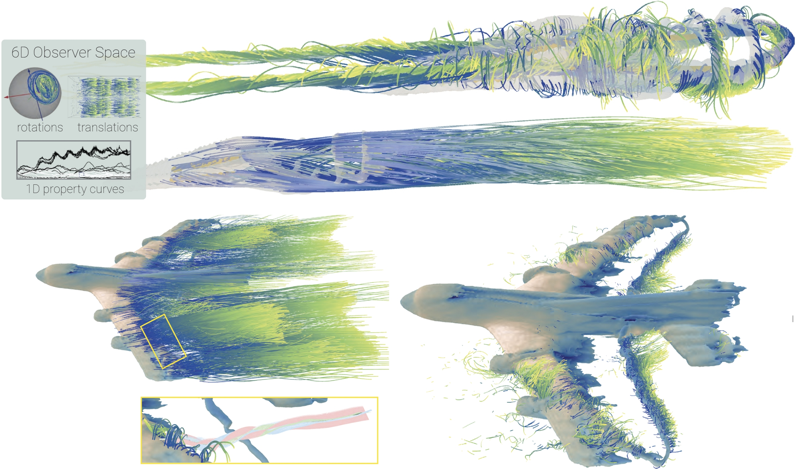

# PyFlowVis:



This repository is a hybrid C++ Python framework for flow visualization, containing:
A simplified Python fluid visualization renderer and GUI based on imgui, possibly with several projects related to flow visualization.


### Install dependency for PyFlowVis
``` 
pip install -r requirements gui.txt
```
### Start the visualization Engine
```
python main.py
```
### Instruction of developer
0. PyflowVis is using an Engine-Plugin system, you can define your own object(with variables and custom UI interfaces), and pluguin to the system, then it will become a imgui pannel, you can get thoes variables Example code:
```
class GuiTest(Object):
    def __init__(self):
        super().__init__("GuiTest")
        
        self.create_variable_gui("boolean_var", True, False,{'widget': 'checkbox'})
        self.create_variable_gui("checkbox_int",1,False,{'widget': 'checkbox'})
        self.create_variable_gui("input_int",1,False, {'widget': 'input'})
        self.create_variable_gui("default_int",1,False)
        self.create_variable_gui("slider_float",0.5,False, {'widget': 'slider_float', 'min': 0.0, 'max': 1.0})
        self.create_variable_gui("color_vec3", (255.0, 0.0, 0.0), False,{'widget': 'color_picker'})
        self.create_variable("input_vec4", [1, 1, 1, 1])        
        self.create_variable_gui("default_vec4", (255, 0, 0,0))
        
        self.create_variable_gui("input_ivec3", (255, 0, 0), False,{'widget': 'input'})
        self.create_variable_gui("ivecn", (0, 0, 1,1,0,2))
        self.create_variable_gui("vecn", (255, 0, 0,0,0,0))

        self.create_variable_gui("float_array_var_plot", [0.1, 0.2, 0.3, 0.4,0.2], False,{'widget': 'plot_lines'})         
        self.create_variable_gui("string_var", "Hello ImGui", False,{'widget': 'input'})
        self.create_variable_gui("string_var2", "Hello ImGui", False)
        
        self.addAction("reload NoiseImage", lambda object: print("reload image")) 
        testDictionary = { "a": 1, "array0": [0.1, 0.2, 0.3, 0.4,0.2], "StepSize2": 3.0,"sonDictionary":{"son_a": 11, "array1": [0.3, 0.2, 0.3],"gradSondict": {"gradSon_b":22 ,"gradVec":[1,2,3]}}}
        self.create_variable("testDictionary",testDictionary,False)
```

2. VisualizationEngine.py is the main logic of this Engine-Plugin system.
3. For performance-senstive operation, you can write C++ functions in the 'Cppmodules ' folder and build with CMake to export C++ functions to Python (using pybind), e.g,. CppProjects\PybindCppModules\LicRendering.cpp. A pythond interface to use pybind c++ LicRendering is given in: FLowUtils\LicRenderer.py
   
4. For pure cpp program , write it in  'CppProjects' folder and build with CMake, e.g. Vastitas data generator.

# TODO list General
0. optc optimize di term +ci term(most important thing!)
1. add Lic and texture manager for the plane.
2. add mouse click intersection with pickable object
3. reference frame transformation

## possible optimize 
1. multiple thread rendering using glMultiDrawArrays
2. vertex array object operate geometry,indices,texture as list, could using numpy.array for fast operation.


# Project 1: VortexTransformer: End‐to‐End Objective Vortex Detection in 2D Unsteady Flow Using Transformers


The implementation of the "VortexTransformer: End‐to‐End Objective Vortex Detection in 2D Unsteady Flow Using Transformers" project includes three parts:

> + A.  Vastitas training data generation implemented in C++: CppProjects/src/flowGenerator.cpp and main.cpp.
> + B.  licrender implemented with pybind/C++ for fast Line Integral Convolution (LIC) rendering from Python: CppProjects/PybindCppModules
> + C.  VortexTransformer model components: [`DeepUtils\models\segmentation\pathline_transformer.py`](./DeepUtils\models\segmentation\pathline_transformer.py)

### Install dependency for project 1
``` 
pip install -r requirements.txt
          
```

### Build Vatistas velocity data generator

```
cd  CppProjects
Git submodule update --init
mkdir build 
cd build
cmake ..  -B .
```
### Train & Test Vortex Transformer
``` 
python train.py  --config config/segmentation/pathline_transformer.yaml
                        //config/segmentation/vortexboundary_unet.yaml for runing other baselines     
python test.py  --config config/segmentation/pathline_transformer.yaml             
``` 

If you use this code, please cite:
```
@inproceedings{zhang2025vortextransformer,
  title={VortexTransformer: End-to-End Objective Vortex Detection in 2D Unsteady Flow Using Transformers},
  author={Zhang, Xingdi and Rautek, Peter and Hadwiger, Markus},
  booktitle={Computer Graphics Forum},
  pages={e70042},
  year={2025},
  organization={Wiley Online Library}
}
```


# Project 2: Exploring 3D Unsteady Flow using 6D Observer Space Interactions



### Code
We provide C++ code for the algorithm proposed in our paper "Exploring 3D Unsteady Flow using 6D Observer Space Interactions." Please note that while our implementation relies on a custom C++-based visualization engine, we are unable to share the full engine source code. Instead, we provide extracted and slightly modified portions of the code to improve readability and accessibility.

The implementation includes the following key components:

- Observer-Relative scalar field transformation: [`CppProjects/src/explore_3d_vector_field/interactive_observed_iso_surface.cpp`](./CppProjects/src/explore_3d_vector_field/interactive_observed_iso_surface.cpp)
- Observer-Relative Pathline Filtering: [`CppProjects/src/explore_3d_vector_field/interactive_observed_pathline.cpp`](./CppProjects/src/explore_3d_vector_field/interactive_observed_pathline.cpp) 
- Observer-Relative Isosurface Animation: [`CppProjects/src/explore_3d_vector_field/interactive_observed_iso_surface.cpp`](./CppProjects/src/explore_3d_vector_field/interactive_observed_iso_surface.cpp)

The implementation relies on several utility classes and interfaces defined in:
- `IsoSurface.h/cpp`: Isosurface computation
- `ReferenceFrame3d.h/cpp`: Reference frame transformations
- `Discrete3DFlowField.h/cpp`: 3D vector field data structures, pathine, streamline integration.

For a complete understanding of the algorithms, please refer to the supplementary materials of our paper which include detailed pseudocode for all core components.
Our code relies on VTK-9.4.1.


If you use this code, please cite:

```
@inproceedings{zhang2025Explore3DUnsteadyFlow,
  title={Exploring 3D Unsteady Flow using 6D Observer Space Interactions},
  author={Zhang, Xingdi and  Ageeli,Amani and  Theu{\ss}l,Thomas and  Hadwiger, Markus and  Rautek, Peter },
  year={2025},
}
```