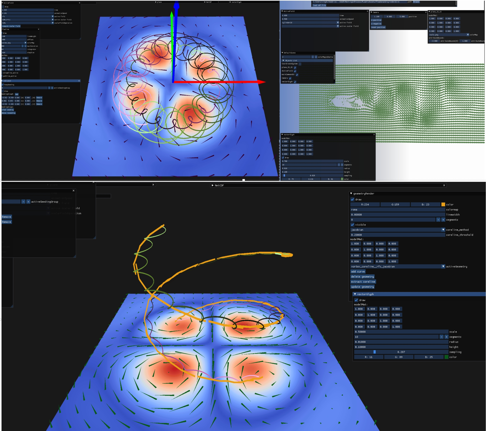
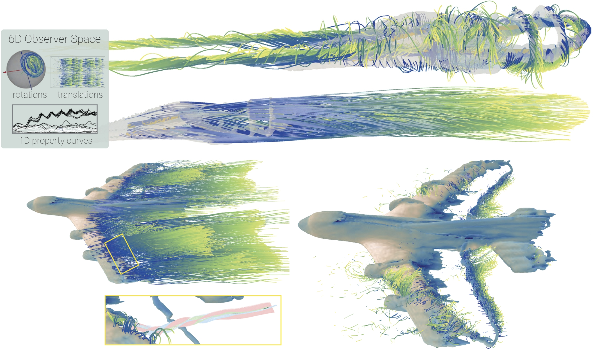

# PyFlowVis



This repository is a hybrid C++ Python framework for flow visualization, containing:
A simplified Python fluid visualization renderer and GUI based on imgui, possibly with several projects related to flow visualization.
## Basic Features of PyFlowVis


### 2D Vector Field Visualization
- **Vector Glyph**: Visualizes the direction and magnitude of the vector field at sampled grid points using arrows or glyphs.
- **Indicator (Seeding of Flowline)**: Allows interactive placement of seed points for flowline/pathline integration and visualization.
- **Flowline/Pathline**: Integrates and visualizes flowlines (streamlines at a fixed time) and pathlines (trajectories over time) from user-defined seeds.
- **Coreline**: coreline (of 2D unsteady field) extraction based on q-crterion/jacobian/velocity critical points.
- **Scalar Field**: Supports visualization of scalar fields (e.g., magnitude, vorticity) as color maps or overlays.

### 3D Vector Field Visualization
- **Basic:** 3 D vector glyphs, 3D pathlines,streamlines,coreline using vtkVortexCore lower Order(v||a).
- **(wip)**: Other 3D features are under development. Planned features include iso-surface rendering, volume rendering of scalar field, observer-relative isosurface/pathline filtering, etc.


## Installation

To install the necessary dependencies for PyFlowVis, run:
```bash
pip install -r requirements_gui.txt
```

## Running the Visualization Engine
To start the engine, execute:
```bash
python main.py
```

## Developer Instructions

PyFlowVis utilizes an engine-plugin architecture. You can define custom objects with their own variables and UI elements and integrate them into the system as ImGui panels.

For example:
```python
class GuiTest(Object):
    def __init__(self):
        super().__init__("GuiTest")
        
        self.create_variable_gui("boolean_var", True, False,{'widget': 'checkbox'})
        self.create_variable_gui("checkbox_int",1,False,{'widget': 'checkbox'})
        self.create_variable_gui("input_int",1,False, {'widget': 'input'})
        self.create_variable_gui("default_int",1,False)
        self.create_variable_gui("slider_float",0.5,False, {'widget': 'slider_float', 'min': 0.0, 'max': 1.0})
        self.create_variable_gui("color_vec3", (255.0, 0.0, 0.0), False,{'widget': 'color_picker'})
        self.create_variable("input_vec4", [1, 1, 1, 1])        
        self.create_variable_gui("default_vec4", (255, 0, 0,0))
        
        self.create_variable_gui("input_ivec3", (255, 0, 0), False,{'widget': 'input'})
        self.create_variable_gui("ivecn", (0, 0, 1,1,0,2))
        self.create_variable_gui("vecn", (255, 0, 0,0,0,0))

        self.create_variable_gui("float_array_var_plot", [0.1, 0.2, 0.3, 0.4,0.2], False,{'widget': 'plot_lines'})         
        self.create_variable_gui("string_var", "Hello ImGui", False,{'widget': 'input'})
        self.create_variable_gui("string_var2", "Hello ImGui", False)
        
        self.addAction("reload NoiseImage", lambda object: print("reload image")) 
        testDictionary = { "a": 1, "array0": [0.1, 0.2, 0.3, 0.4,0.2], "StepSize2": 3.0,"sonDictionary":{"son_a": 11, "array1": [0.3, 0.2, 0.3],"gradSondict": {"gradSon_b":22 ,"gradVec":[1,2,3]}}}
        self.create_variable("testDictionary",testDictionary,False)
```

1. **Engine-Plugin System**: The core logic is in [`VisualizationEngine.py`](./GuiObjcts/VisualizationEngine.py). See [`PlanarManifold.py`](./GuiObjcts/PlanarManifold.py) for an example of how to create and use custom objects.

2. **Performance-Sensitive Operations**: For demanding tasks, write C++ functions in the `CppProjects/PybindCppModules` folder and build them with CMake to export them to Python using PyBind11. An example of a Python interface for a C++ module is `FLowUtils/LicRenderer.py`, which wraps the C++ LIC renderer.

3. **Standalone C++ Programs**: For pure C++ applications, such as the Vatistas data generator, place the source code in the `CppProjects` folder and build it using CMake.


# Project 1: VortexTransformer
End‐to‐End Objective Vortex Detection in 2D Unsteady Flow Using Transformers


The implementation of the "VortexTransformer" project consists of three main components:

- **A. Vatistas Data Generator**: A C++ tool for generating training data, located in `CppProjects/src/flowGenerator.cpp` and `main.cpp`.
- **B. LIC Renderer**: A high-performance Line Integral Convolution (LIC) renderer implemented in C++ and exposed to Python via PyBind11. The source code is in `CppProjects/PybindCppModules`.
- **C. VortexTransformer Model**: The core model components are implemented in [`DeepUtils/models/segmentation/pathline_transformer.py`](./DeepUtils/models/segmentation/pathline_transformer.py).

### Install dependency for project 1
``` 
pip install -r requirements.txt
          
```

### Build Vatistas velocity data generator
Due to the size of dataset, we can't share it here, but you can request by contact my email or generate the sythetic Vatistas dataset by yourself: Built the project using CMAKE, and  then open the FlowGenerator.sln in visual studio and generate your dataset.
```
cd  CppProjects
Git submodule update --init
mkdir build 
cd build
cmake ..  -B .
```

### Training and Testing the Vortex Transformer
Once the dataset is generated, you can train the model:
```bash
python train.py --config config/segmentation/pathline_transformer.yaml --data_dir "PATH_TO_DATASET"
```

We also provide a pretrained model for testing, first unzip trainedVortexTransformer/demoValidationDataset.7z(.001,.002) as folder "trainedVortexTransformer/demoValidationDataset", then:
```bash
# Test the pretrained VortexTransformer model
python test.py --config config/segmentation/pathline_transformer.yaml --data_dir ./trainedVortexTransformer/demoValidationDataset/ --model_path ./trainedVortexTransformer/best_checkpoint.pth.tar

# Run other baselines (e.g., VortexBoundary-UNet)
python train.py --config config/segmentation/vortexboundary_unet.yaml --data_dir "PATH_TO_DATASET"
```

If you use this code, please cite:
```bibtex
@inproceedings{zhang2025vortextransformer,
  title={VortexTransformer: End-to-End Objective Vortex Detection in 2D Unsteady Flow Using Transformers},
  author={Zhang, Xingdi and Rautek, Peter and Hadwiger, Markus},
  booktitle={Computer Graphics Forum},
  pages={e70042},
  year={2025},
  organization={Wiley Online Library}
}
```


# Project 2: Exploring 3D Unsteady Flow with 6D Observer-Space Interactions



### Code
We provide C++ code for the algorithm proposed in our paper "Exploring 3D Unsteady Flow using 6D Observer Space Interactions." Please note that while our implementation relies on a custom C++-based visualization engine, we are unable to share the full engine source code. Instead, we provide extracted and slightly modified portions of the c++ code to improve readability and accessibility.


The implementation includes the following key components:

- Observer-Relative scalar field transformation: [`CppProjects/src/explore_3d_vector_field/interactive_observed_iso_surface.cpp`](./CppProjects/src/explore_3d_vector_field/interactive_observed_iso_surface.cpp)
- Observer-Relative Pathline Filtering: [`CppProjects/src/explore_3d_vector_field/interactive_observed_pathline.cpp`](./CppProjects/src/explore_3d_vector_field/interactive_observed_pathline.cpp) 
- Observer-Relative Isosurface Animation: [`CppProjects/src/explore_3d_vector_field/interactive_observed_iso_surface.cpp`](./CppProjects/src/explore_3d_vector_field/interactive_observed_iso_surface.cpp)

The implementation relies on several utility classes and interfaces defined in:
- [`IsoSurface.h/cpp`](./CppProjects/src/explore_3d_vector_field/IsoSurface.cpp): Isosurface computation
- [`ReferenceFrame3d.h/cpp`](./CppProjects/src/explore_3d_vector_field/ReferenceFrame3d.cpp): Reference frame transformations
- [`Discrete3DFlowField.h/cpp`](./CppProjects/src/explore_3d_vector_field/Discrete3DFlowField.cpp): 3D vector field data structures, pathine, streamline integration.

For a complete understanding of the algorithms, please refer to the supplementary materials of our paper which include detailed pseudocode for all core components.
Our code relies on VTK-9.4.1.

***Note*** : We will gradually migrate these C++ code to PyFlowVis. Once done, you will see specification and links to python files.


If you use this code, please cite:

```
@inproceedings{zhang2025Explore3DUnsteadyFlow,
  title={Exploring 3D Unsteady Flow using 6D Observer Space Interactions},
  author={Zhang, Xingdi and  Ageeli,Amani and  Theu{\ss}l,Thomas and  Hadwiger, Markus and  Rautek, Peter},
  year={2025},
}
```