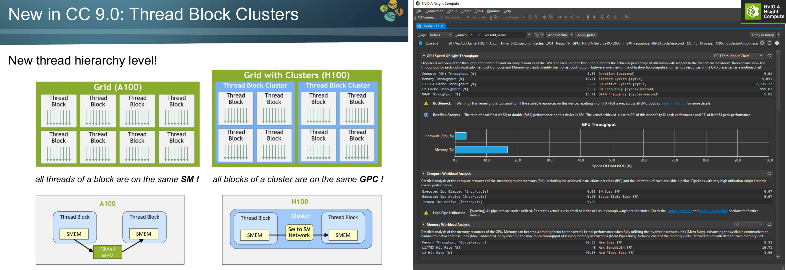

# PyFlowVis：CUDA-Accelerated High-Performance Flow Visualization Framework


This repository provides **<font color=#FFFF00>PyFlowVis</font>**, which is a **flow visualization infrastructure**. It is a <font color=#FFFF00>hybrid C++/Python/CUDA framework</font> for real-time high-performance flow visualization with an emphasis on CUDA acceleration and computational performance.

## Architecture Overview

1. **Front-end User Interface (python)**: Implemented with <font color=#0CBCED>ImGui</font>, featuring an engine-plugin system that is developer-friendly for implementing custom objects, functionality, and extensions.

2. **Rendering Backend**: Based on <font color=#0CBCED>PyOpenGL</font> for efficient graphics rendering.

3. **Computation Backend**: Supports  <font color=#0CBCED>numba+njit</font>, C++ (via <font color=#0CBCED>PyBind</font>) and <font color=#0CBCED>CUDA</font> implementations for maximum performance flexibility.


Built on top of this `pyflowvis` infrastructure are **multiple flow analysis and visualization projects**:
1. VortexTransformer: End‐to‐End Objective Vortex Detection in 2D Unsteady Flow Using Transformers
2. Exploring 3D Unsteady Flow with 6D Observer-Space Interactions
3. FMT: TRAINING-FREE OBJECTIVE FLOWMAP TOK-
ENIZER
#### Platform & Requirement:  
All the cuda implementation have been tested on Windows 10/11 with CUDA versions 11.8 and 12.6. Before using our CUDA implementation, you need to first run [`TestPyCUDA.py`](misc/TestPyCUDA.py) to verify your setup. If the CUDA implementation is unavailable, function call will fallback to the CPU implementation.


## Functionalities of PyFlowVis
### Basic Vector Field Visualization
- **Vector Glyph**: Visualizes the direction and magnitude of the vector field at sampled grid points using arrows or glyphs.
- **LIC Texture**: C++ implementation of offline LIC texture computation.
- **Indicator (Seeding of Flowline)**: Allows interactive placement of seed points for flowline/pathline integration and visualization.
- **Coreline**: coreline (of 2D unsteady field) extraction based on q-crterion/jacobian/velocity critical points.
- **Scalar Field**: Supports visualization of scalar fields (e.g., magnitude, vorticity) as color maps or overlays.
- **Field IO**: 
> - NetCDF loader for unsteady 2D/3D vector fields; 
> - Amira loader for unsteady 2D/3D vector fields; 
> - ['Johns Hopkins Turbulence Databases'](https://turbulence.idies.jhu.edu/database) loader for turbelent flow.

### CUDA based High-Performance Vector Field Visualization
PyFlowVis accelerates the most demanding algorithms—pathline integration (first-order ODE solving), flowmap and FTLE computation, and optimal reference frame optimization (via least squares)—using custom-designed CUDA kernels that feature optimized <font color=#FFFF00>warp scheduling and shared memory access. (Nsight Compute report avaible)</font>


- **Streamline/Pathline Integration**: We implement multiple optimized integrators for computing flow trajectories, focusing on <font color=#FFFF00>__load balancing and efficient GPU utilization__</font>:
>  + CPU (Numba-accelerated): Python-based Euler, RK4, and RK5 integrators with @njit acceleration for fast vector field queries.
>  + CUDA Kernels:  Euler and RK4 integrators fully implemented on GPU.
>  + Differentiable Solvers: Integration via torchdiffeq (dopri5, dopri8, bosh3, fehlberg2, adaptive_heun) for gradient-based applications.   
- **FTLE**: Computes 2D FTLE using custom CUDA kernels. Includes a baseline implementation ([FTLE_2D_CUDA.cu](assets/cuda_kernal/FTLE_2D_CUDA.cu)) and an optimized version leveraging <font color=#FFFF00>shared memory</font> ([FTLE_2D_CUDA_sharemem.cu](assets/cuda_kernal/FTLE_2D_CUDA_sharemem.cu)) for maximum performance. We try benckmark and optimize for <font color=#FFFF00>H100(compute capbitiy 9.0/cuda 12.6) and 3090 (CC 8.6/cuda 12.6). </font>

- **Optimal Reference Optimization** : we implement the algorithm of paper "Generic objective vortices for flow visualization"[ Günther et al 2017] for unsteady 2D/3D field using cuda.(wip)
  



### wip: 3D Vector Field Visualization
- **Basic:** 3 D vector glyphs, 3D pathlines,streamlines,coreline using vtkVortexCore lower Order(v||a) implemented as demonstrated above.
- **(wip)**: Other 3D features are under development. Planned features include iso-surface rendering, volume rendering of scalar field, observer-relative isosurface/pathline filtering, etc.


## Installation

To install the necessary dependencies for PyFlowVis, run:
```bash
pip install -r requirements_gui.txt
```

## Running the Visualization Engine
To start the engine, execute:
```bash
python main.py
```

## Developer Instructions

PyFlowVis utilizes an engine-plugin architecture. You can define custom objects with their own variables and UI elements and integrate them into the system as ImGui panels.
#### Note: For the detail, please see our [documentation](documentation_1.md), it's not finished, but provide some instructions.

For example:
```python
class GuiTest(Object):
    def __init__(self):
        super().__init__("GuiTest")
        
        self.create_variable_gui("boolean_var", True, False,{'widget': 'checkbox'})
        self.create_variable_gui("checkbox_int",1,False,{'widget': 'checkbox'})
        self.create_variable_gui("input_int",1,False, {'widget': 'input'})
        self.create_variable_gui("slider_float",0.5,False, {'widget': 'slider_float', 'min': 0.0, 'max': 1.0})
        self.create_variable_gui("color_vec3", (255.0, 0.0, 0.0), False,{'widget': 'color_picker'})
        self.create_variable("input_vec4", [1, 1, 1, 1])        
        self.create_variable_gui("default_vec4", (255, 0, 0,0))
        
        self.create_variable_gui("input_ivec3", (255, 0, 0), False,{'widget': 'input'})
        self.create_variable_gui("ivecn", (0, 0, 1,1,0,2))
        self.create_variable_gui("vecn", (255, 0, 0,0,0,0))

        self.create_variable_gui("float_array_var_plot", [0.1, 0.2, 0.3, 0.4,0.2], False,{'widget': 'plot_lines'})         
        self.create_variable_gui("string_var", "Hello ImGui", False,{'widget': 'input'})
        self.create_variable_gui("string_var2", "Hello ImGui", False)
        
        self.addAction("reload NoiseImage", lambda object: print("reload image")) 
        testDictionary = { "a": 1, "array0": [0.1, 0.2, 0.3, 0.4,0.2], "StepSize2": 3.0,"sonDictionary":{"son_a": 11, "array1": [0.3, 0.2, 0.3],"gradSondict": {"gradSon_b":22 ,"gradVec":[1,2,3]}}}
        self.create_variable("testDictionary",testDictionary,False)
```

1. **Engine-Plugin System**: The core logic is in [`VisualizationEngine.py`](./GuiObjcts/VisualizationEngine.py). See [`PlanarManifold.py`](./GuiObjcts/PlanarManifold.py) for an example of how to create and use custom objects.

2. **Performance-Sensitive Operations**: For demanding tasks, write C++ functions in the `CppProjects/PybindCppModules` folder and build them with CMake to export them to Python using PyBind11. An example of a Python interface for a C++ module is `FLowUtils/LicRenderer.py`, which wraps the C++ LIC renderer.

3. **Standalone C++ Programs**: For pure C++ applications, such as the Vatistas data generator, place the source code in the `CppProjects` folder and build it using CMake.


---

# Project 1: VortexTransformer
End‐to‐End Objective Vortex Detection in 2D Unsteady Flow Using Transformers


The implementation of the "VortexTransformer" project consists of three main components:

- **A. Vatistas Data Generator**: A C++ tool for generating training data, located in `CppProjects/src/flowGenerator.cpp` and `main.cpp`.
- **B. LIC Renderer**: A high-performance Line Integral Convolution (LIC) renderer implemented in C++ and exposed to Python via PyBind11. The source code is in `CppProjects/PybindCppModules`.
- **C. VortexTransformer Model**: The core model components are implemented in [`DeepUtils/models/segmentation/pathline_transformer.py`](./DeepUtils/models/segmentation/pathline_transformer.py).

### Install dependency for project 1
``` 
pip install -r requirements.txt
          
```

### Build the Vatistas Velocity Data Generator

You can either build the data generator yourself, particularly if you want to extend the dataset by fitting additional flow datasets with parametrized Vatistas vortex models, or download the pre-generated Vatistas dataset from Zenodo:

<https://zenodo.org/records/21277295>

To build the generator, initialize the required Git submodules and configure the project using CMake:

```bash
cd CppProjects
git submodule update --init
mkdir build
cd build
cmake .. -B .

### Training and Testing the Vortex Transformer
Once the dataset is generated, you can train the model:
```bash
python train.py --config config/segmentation/pathline_transformer.yaml --data_dir "PATH_TO_DATASET"
```

We also provide a pretrained model for testing, first unzip trainedVortexTransformer/demoValidationDataset.7z(.001,.002) as folder "trainedVortexTransformer/demoValidationDataset", then:
```bash
# Test the pretrained VortexTransformer model
python test.py --config config/segmentation/pathline_transformer.yaml --data_dir ./trainedVortexTransformer/demoValidationDataset/ --model_path ./trainedVortexTransformer/best_checkpoint.pth.tar
```

We also implement other baselines talked in our paper, and you can run them by:
```bash
# Run other baselines (e.g., VortexBoundary-UNet)
python train.py --config config/segmentation/vortexboundary_unet.yaml --data_dir "PATH_TO_DATASET"
python train.py --config config/classification/vortex_viz.yaml --data_dir "PATH_TO_DATASET"
python train.py --config config/segmentation/mvu_net.yaml --data_dir "PATH_TO_DATASET"
```

---

# Project 2: Exploring 3D Unsteady Flow with 6D Observer-Space Interactions


### Code
We provide C++ code for the algorithm proposed in our paper "Exploring 3D Unsteady Flow using 6D Observer Space Interactions." Please note that while our implementation relies on a custom C++-based visualization engine, we are unable to share the full engine source code. Instead, we provide extracted and slightly modified portions of the c++ code to improve readability and accessibility.


The implementation includes the following key components:

- Observer-Relative scalar field transformation: [`CppProjects/src/explore_3d_vector_field/interactive_observed_iso_surface.cpp`](./CppProjects/src/explore_3d_vector_field/interactive_observed_iso_surface.cpp)
- Observer-Relative Pathline Filtering: [`CppProjects/src/explore_3d_vector_field/interactive_observed_pathline.cpp`](./CppProjects/src/explore_3d_vector_field/interactive_observed_pathline.cpp) 
- Observer-Relative Isosurface Animation: [`CppProjects/src/explore_3d_vector_field/interactive_observed_iso_surface.cpp`](./CppProjects/src/explore_3d_vector_field/interactive_observed_iso_surface.cpp)

The implementation relies on several utility classes and interfaces defined in:
- [`IsoSurface.h/cpp`](./CppProjects/src/explore_3d_vector_field/IsoSurface.cpp): Isosurface computation
- [`ReferenceFrame3d.h/cpp`](./CppProjects/src/explore_3d_vector_field/ReferenceFrame3d.cpp): Reference frame transformations
- [`Discrete3DFlowField.h/cpp`](./CppProjects/src/explore_3d_vector_field/Discrete3DFlowField.cpp): 3D vector field data structures, pathine, streamline integration.

For a complete understanding of the algorithms, please refer to the supplementary materials of our paper which include detailed pseudocode for all core components.
Our code relies on  <font color=#0CBCED>VTK-9.4.1</font>.

***Note*** : We will gradually migrate these C++ code from our closed source engine to PyFlowVis. Once done, you will see specification and links to python files.

### Data

Large flow datasets are not included in this repository. The LBM-based unsteady flow datasets used in the paper are available from Zenodo:

- **X_FLUIDX3D LBM-based unsteady flow dataset, volume 1:** https://zenodo.org/records/19419413
- **X_FLUIDX3D LBM-based unsteady flow dataset, volume 2:** https://zenodo.org/records/19427191

Additional datasets used in the paper but not included here:

- **3D Unsteady Half Cylinder Ensemble, and smokeBuoyancy**, generated with the Gerris solver and provided by the Visual Computing group at FAU:

  https://vc.tf.fau.de/publications/datasets/

Please follow the licenses, citation requirements, and terms of use specified by each dataset provider.

---


## Citation
If you use PyFlowVis, or its components in your research, please cite  the following  Paper (VortexTransformer):

```bibtexW
@article{https://doi.org/10.1111/cgf.70042,
author = {Zhang, X. and Rautek, P. and Hadwiger, M.},
title = {VortexTransformer: End-to-End Objective Vortex Detection in 2D Unsteady Flow Using Transformers},
journal = {Computer Graphics Forum},
volume = {44},
number = {2},
pages = {e70042},
doi = {https://doi.org/10.1111/cgf.70042},
url = {https://onlinelibrary.wiley.com/doi/abs/10.1111/cgf.70042},
eprint = {https://onlinelibrary.wiley.com/doi/pdf/10.1111/cgf.70042},
year = {2025}
}
```


If you use the LBM simulated 3D FLow Data, please cite the following Paper (Exploring 3D Unsteady Flow using 6D Observer Space Interactions):
```bibtex
@ARTICLE{11295972,
  author={Zhang, Xingdi and Ageeli, Amani and Theußl, Thomas and Hadwiger, Markus and Rautek, Peter},
  journal={IEEE Transactions on Visualization and Computer Graphics}, 
  title={Exploring 3D Unsteady Flow using 6D Observer Space Interactions}, 
  year={2026},
  volume={32},
  number={1},
  pages={517-526},
  doi={10.1109/TVCG.2025.3642506}
  }

```

## License
This project is licensed under the Apache License, Version 2.0. See the
[LICENSE](./LICENSE) file for details. Attribution notices are provided in [NOTICE](./NOTICE).
